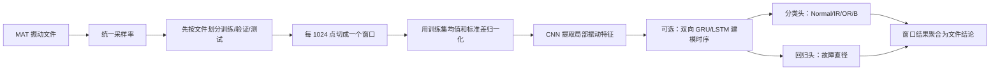
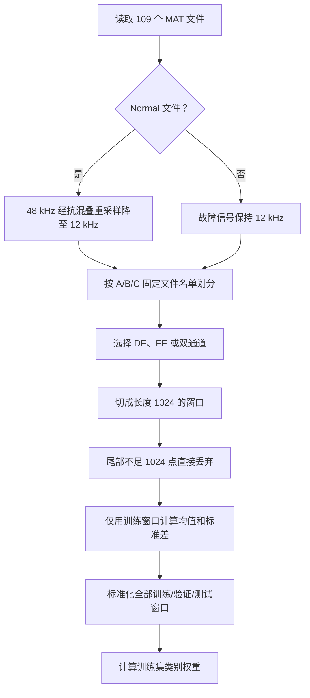
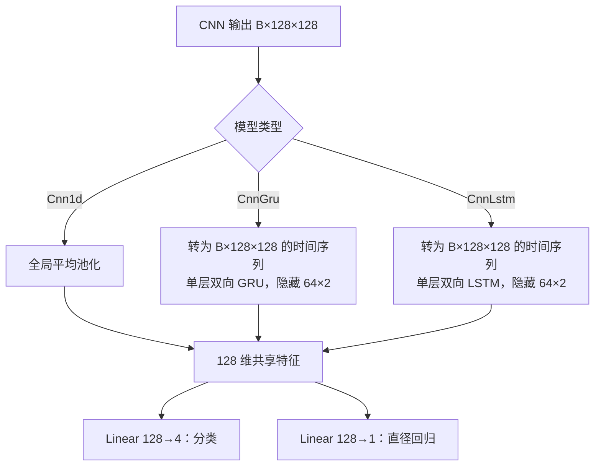
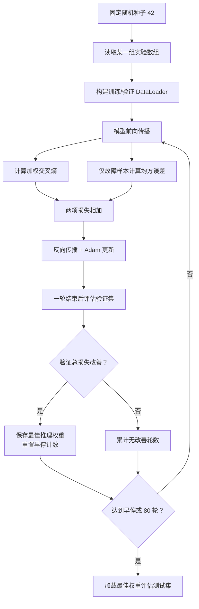

# CWRU 轴承故障诊断项目：PPT 提纲逐项讲解

> 本文不是代码说明书，而是面向汇报者的“项目白盒化”讲解。目标是让你知道项目解决了什么、数据如何流动、模型为什么这样设计、实验结果能说明什么，以及答辩时哪些话不能说得太满。

## 先用一分钟看懂整个项目

这是一个基于 **CWRU（Case Western Reserve University）轴承振动数据**的多任务学习项目。模型读取一段长度为 1024 的一维振动信号，同时完成两件事：

1. 判断轴承状态：正常（Normal）、内圈故障（IR）、外圈故障（OR）或滚动体故障（B）。
2. 如果存在故障，估计故障直径：7、14、21 或 28 mil 附近的连续数值。

其中：

- **DE** 是驱动端传感器信号（Drive End）；
- **FE** 是风扇端传感器信号（Fan End）；
- **mil** 是千分之一英寸，1 mil = 0.001 inch ≈ 0.0254 mm；
- IR、OR、B 分别表示内圈、外圈和滚动体故障。

一句话概括整个处理链：

项目实际完成了 **90 组正式实验**：

$$3\text{ 套文件划分}\times2\text{ 种切窗方式}\times5\text{ 种输入方案}\times3\text{ 种模型}=90$$

所有 90 组均已训练和评估完成，没有失败。

---

## 2. 项目背景与任务

### 2.1 实际问题是什么

滚动轴承是电机和旋转机械中的关键部件。内圈、外圈或滚动体出现点蚀、裂纹后，设备仍可能继续转动，但振动信号中会出现周期性冲击。如果不能及时发现，局部故障可能扩大，最终造成停机或设备损坏。

传统人工诊断往往依赖频谱、包络谱和工程师经验。本项目尝试让神经网络直接从原始振动波形中学习特征，自动给出“哪里坏了”和“大约坏到什么程度”。

### 2.2 项目目标是什么

项目包含两个同时训练的任务：

| 任务 | 含义 | 输出 |
|---|---|---|
| 四分类 | 判断轴承状态 | Normal、IR、OR、B 四类概率 |
| 故障直径回归 | 估计故障尺寸 | 一个连续数值，单位 mil |

这叫做**多任务学习**：同一个特征提取网络后接两个输出头。分类头学习故障类型，回归头学习故障程度。

### 2.3 模型输入是什么

模型每次接收一个振动窗口：

- 单通道实验：形状为 `[batch, 1, 1024]`；
- 双通道实验：形状为 `[batch, 2, 1024]`，两个通道按 `[DE, FE]` 排列；
- 1024 个采样点在 12 kHz 下约对应 85.3 ms 的振动。

项目比较了五种输入方案：

| 输入方案 | 文件数 | 实际输入 |
|---|---:|---|
| `dual101` | 101 | 同一文件的 DE 和 FE 两路信号 |
| `109DEFE` | 109 | 驱动端故障取 DE，风扇端故障取 FE，Normal 取 DE |
| `101DEFE` | 101 | 同上，但排除 28 mil 文件 |
| `109DE` | 109 | 所有文件统一取 DE |
| `101DE` | 101 | 排除 28 mil，所有文件统一取 DE |

`DEFE` 不是模型自动选择传感器，而是数据准备阶段已经根据已知的故障端选择离故障更近的通道。这一点答辩时要说清楚。

### 2.4 模型输出是什么

模型对每个窗口输出：

- 4 个分类 logits，经 Softmax 后变成四类概率；
- 1 个故障直径回归值。

回归训练时使用 `真实直径 / 7` 作为标签，例如 7、14、21、28 mil 分别变成 1、2、3、4；展示时再乘以 7。这样做只是缩小数值尺度，使回归训练更稳定。

Normal 没有“故障直径”，因此它参与分类训练，但不参与回归损失。推理时如果最终分类为 Normal，对用户显示的直径为 0。

### 2.5 PPT 这一部分应该放什么

建议用 1 页：左侧画“轴承—传感器—振动波形”，右侧放输入输出框。页面只保留三句话：

- 输入：1024 点、1/2 通道振动信号；
- 输出 1：Normal / IR / OR / B；
- 输出 2：故障直径（mil）。

可直接讲：

> 本项目面向滚动轴承状态监测。模型不使用负载、转速或故障位置等人工属性，只读取原始振动信号；它一方面识别正常、内圈、外圈和滚动体四种状态，另一方面估计故障直径，因此是一个共享特征、双输出头的多任务模型。

---

## 3. 数据集与预处理

### 3.1 数据来源与规模

数据来自凯斯西储大学 CWRU 轴承数据集，项目目录中实际使用 109 个 MAT 文件。

| 类别 | 文件数 | 含义 |
|---|---:|---|
| Normal | 4 | 正常轴承 |
| IR | 28 | 内圈故障 |
| OR | 49 | 外圈故障 |
| B | 28 | 滚动体故障 |
| 合计 | 109 | — |

按故障直径统计：0 mil（Normal）4 个、7 mil 40 个、14 mil 25 个、21 mil 32 个、28 mil 8 个。

数据并不平衡：Normal 只有 4 个原始文件，OR 有 49 个文件。把一个文件切成很多窗口并不能增加独立的实验工况，所以不能因为窗口很多就忽略原始文件少的问题。

### 3.2 为什么有 101 文件和 109 文件两套集合

101 文件集合不含 8 个 28 mil 文件；109 文件集合保留全部数据。这样设计是为了比较：加入 28 mil 数据后，分类和回归是否变化。

但 28 mil 文件与前三档在轴承厂家、故障加工条件、通道可用性等方面存在混杂。因此即使 28 mil 表现很好，也不能简单断言模型学会了普适的“严重故障规律”，它也可能利用了数据来源差异。

### 3.3 训练、验证、测试集怎样划分

项目最重要的数据规则是：**先按完整文件划分，再在文件内部切窗口。**

| 文件集合 | 训练 | 验证 | 测试 |
|---|---:|---:|---:|
| 101 文件 | 71 | 15 | 15 |
| 109 文件 | 75 | 17 | 17 |

项目准备了 A、B、C 三套固定划分。每一套都满足上表数量，并尽量覆盖四类故障、驱动端/风扇端、不同直径、负载和外圈钟点位置。三套测试集互不重复，用于观察结果是否依赖某一次文件划分。

为什么不能先切窗口再随机划分？因为同一原始文件相邻窗口高度相似。如果一个文件的窗口同时出现在训练集和测试集，模型可能只是记住该文件的特征，测试分数会虚高。当前做法保证了同一文件不会跨集合，避免最直接的数据泄漏。

### 3.4 主要预处理步骤

具体来说：

1. **统一采样率**：Normal 原始信号为 48 kHz，使用多相重采样降到 12 kHz；故障信号本身保持 12 kHz。这样避免模型仅凭采样率差异识别 Normal。
2. **切窗**：窗口长度固定为 1024。无重叠方案步长 1024；50% 重叠方案步长 512。
3. **标准化**：每个通道执行 `(x - 训练集均值) / 训练集标准差`。均值和标准差只由训练集计算，验证和测试数据不能参与。
4. **类别加权**：分类权重为 `1 / sqrt(训练窗口数)`，再归一化到平均值 1。样本少的 Normal 权重更高，但没有直接删除 OR 数据。
5. **标签构造**：分类标签为 0～3；回归标签为直径除以 7；Normal 的回归掩码为假。

无重叠时，101 文件方案约产生 11,891 个窗口，109 文件方案约 12,833 个窗口；50% 重叠后约为 23,730 和 25,612 个。重叠窗口变多不等于独立信息翻倍，因为相邻窗口共享一半采样点。

### 3.5 PPT 这一部分应该放什么

建议 1～2 页：一页数据分布表，一页预处理流程图。重点强调三句话：

- 109 个文件，四分类并预测直径；
- Normal 从 48 kHz 降到 12 kHz；
- 先按文件划分、再切窗口，防止泄漏。

---

## 4. 模型设计

### 4.1 为什么选择一维 CNN、GRU 和 LSTM

振动信号是一维时间序列。故障冲击往往表现为短时间内的局部波形和重复的时间模式。

- **一维 CNN**适合提取局部冲击、边缘、频率相关纹理；计算快，参数少，是基础模型。
- **双向 GRU**在 CNN 特征序列上继续建模前后时间关系；参数比 LSTM 少。
- **双向 LSTM**同样建模长短期依赖，但门控结构更完整，参数更多。

三者使用相同 CNN 主干和输出头，能较公平地比较“只做局部特征提取”与“再增加时序建模”是否有效。

### 4.2 模型整体结构

三种模型共享以下 CNN 主干：

主干之后有两条路线：

### 4.3 各层或模块的作用

| 模块 | 作用 |
|---|---|
| Conv1d | 在时间轴上滑动，自动学习局部冲击和波形模式 |
| BatchNorm | 稳定中间特征分布，使训练更容易 |
| ReLU | 提供非线性表达能力 |
| MaxPool | 每次将时间长度减半，保留显著响应并降低计算量 |
| 全局平均池化 | 将整段特征压缩成 128 维向量，不关心特征出现的精确位置 |
| 双向 GRU/LSTM | 从正、反两个方向汇总窗口内的时序关系 |
| 分类头 | 输出四类未归一化分数 |
| 回归头 | 输出一个连续故障直径 |

### 4.4 关键结构参数

| 参数 | 设置 |
|---|---|
| 卷积输出通道 | 32 → 64 → 128 |
| 卷积核 | 7 → 5 → 3 |
| 卷积 padding | 3 → 2 → 1，卷积前后长度不变 |
| 池化 | 每层后 MaxPool1d(2)，1024 → 512 → 256 → 128 |
| GRU/LSTM 层数 | 1 层 |
| 是否双向 | 是 |
| 单方向隐藏维度 | 64 |
| 拼接后特征维度 | 128 |
| 输出 | 4 类 + 1 个直径 |

单通道输入时参数量分别约为：Cnn1d 36,357、CnnGru 110,853、CnnLstm 135,685。双通道只使第一层略增，分别为 36,581、111,077、135,909。LSTM 参数最多，但三个模型都属于较轻量级网络。

### 4.5 一条数据在模型中怎样流动

以单通道 CnnLstm 为例：

1. 一个窗口进入模型，形状为 `[1, 1, 1024]`。
2. 三个卷积块后变成 `[1, 128, 128]`：有 128 个抽象特征通道，每个通道保留 128 个时间位置。
3. 交换维度为 `[1, 128, 128]`，此时第二个 128 表示时间步，最后一个 128 表示每个时间步的特征。
4. 双向 LSTM 从两个方向读取 128 个时间步，最终两个 64 维隐藏状态拼接成 128 维向量。
5. 同一个 128 维向量分别送入分类头和回归头。

这就是“共享主干、双任务输出”的真实含义。

### 4.6 为什么没有 Dropout 和数据增强

当前正式方案没有加入 Dropout、噪声增强或随机缩放，而是用固定划分、权重衰减和早停控制训练。优点是训练流程更直接、三种模型比较更容易说明；不足是对实验室数据可能拟合较强，面对真实工业噪声的泛化能力尚未验证。

---

## 5. 模型训练方法

### 5.1 损失函数

总损失为分类损失与回归损失直接相加：

$$L_{total}=L_{cls}+L_{reg}$$

- `L_cls`：带类别权重的交叉熵损失，所有窗口都参与；
- `L_reg`：均方误差，只有 IR、OR、B 故障窗口参与；
- Normal 的回归掩码为假，不会强迫回归头把 Normal 学成某个故障直径。

均方误差会对较大的直径预测误差给予更大惩罚，适合作为本项目直径回归的直接训练目标。

### 5.2 优化与训练参数

| 项目 | 设置 |
|---|---|
| 优化器 | Adam |
| 初始学习率 | 0.001 |
| 权重衰减 | 0.0001 |
| Batch size | 128 |
| 最大训练轮数 | 80 |
| 随机种子 | 42 |
| 学习率调度 | 不使用，学习率固定 |
| 早停耐心值 | 12 |
| 最佳模型依据 | 验证集总损失最低 |

“最多 80 轮”不代表每组一定训练 80 轮。验证总损失连续 12 轮没有改善就提前停止，并保存历史上验证总损失最低的 `best_inference.pt`。

### 5.3 训练流程

### 5.4 为什么评价时分窗口级和文件级

一个 MAT 文件被切成约 118 个窗口。窗口级评价把每个窗口当作一次预测；文件级评价把同一文件的窗口结果聚合：

- 分类：先平均所有窗口的四类概率，再取概率最大的类别；
- 回归：平均该故障文件所有窗口的原始直径预测。

真实应用中用户通常上传一个完整测量文件并希望得到一个最终结论，因此文件级指标更接近应用；窗口级指标则能揭示模型在文件内部是否稳定。

---

## 6. 实验结果与性能分析

### 6.1 先理解：本项目没有一个模型同时在所有指标上绝对最好

90 组结果中：

- **最佳平均分类配置**：无重叠 + `109DEFE` + CnnLstm；
- **最佳平均回归配置**：50% 重叠 + `dual101` + CnnLstm。

因此 PPT 不应只说“最终最佳模型是某某”而不说明评价目标。一个稳妥的汇报方式是：把“无重叠 + 109DEFE + CnnLstm”作为分类主模型，再补充“双通道重叠 LSTM 的直径回归更好”。

### 6.2 分类主模型结果

无重叠 + `109DEFE` + CnnLstm 在 A/B/C 三套划分上的平均结果：

| 指标 | 均值 ± 标准差 |
|---|---:|
| 窗口 Accuracy | 98.49% ± 0.99% |
| 窗口 Macro-F1 | 98.61% ± 0.73% |
| 窗口直径 MAE | 1.24 ± 0.50 mil |
| 文件 Accuracy | 100.00% ± 0.00% |
| 文件 Macro-F1 | 100.00% ± 0.00% |
| 文件直径 MAE | 0.86 ± 0.51 mil |

这里的 100% 只表示这三套固定测试集上的文件级分类全部正确，不能表述成“真实工业场景准确率 100%”。测试数据仍来自同一个实验台和人工故障数据集。

### 6.3 回归最佳配置结果

50% 重叠 + `dual101` + CnnLstm 的 A/B/C 平均结果：

| 指标 | 均值 ± 标准差 |
|---|---:|
| 窗口 Accuracy | 98.25% ± 1.28% |
| 窗口 Macro-F1 | 98.44% ± 1.26% |
| 窗口直径 MAE | 0.85 ± 0.14 mil |
| 文件 Accuracy | 100.00% ± 0.00% |
| 文件直径 MAE | 0.58 ± 0.16 mil |

这说明双端信息和 LSTM 时序建模对直径估计有帮助；但它不含 28 mil 文件，因此不能拿它的总体 MAE与包含 28 mil 的任务做完全等价的因果比较。

### 6.4 三种模型整体怎么比较

对全部输入、切窗和划分汇总后：

| 模型 | 平均窗口 Macro-F1 | 平均窗口直径 MAE |
|---|---:|---:|
| Cnn1d | 96.40% | 2.24 mil |
| CnnGru | 97.35% | 1.29 mil |
| CnnLstm | 96.39% | 1.23 mil |

可以得出：

- CnnGru 的总体分类表现最好；
- CnnLstm 的总体回归误差最低；
- 两种循环模型的回归都明显好于纯 Cnn1d，说明窗口内的时序关系对直径估计有价值；
- CnnLstm 并非每组分类都胜过 CnnGru，所以不能说“模型越复杂一定越好”。

### 6.5 重叠窗口是否有效

跨全部模型与输入汇总：

- 无重叠：平均窗口 Macro-F1 96.43%，MAE 1.63 mil；
- 50% 重叠：平均窗口 Macro-F1 96.99%，MAE 1.55 mil。

重叠带来小幅平均提升，但窗口数和训练开销接近翻倍，而且新增窗口高度相关。因此它是“以更多冗余计算换取小幅改善”，并不是数据量真正翻倍。

### 6.6 典型正确预测

以下来自分类主模型的 A 划分测试结果：

| 测试文件 | 真实类别 | 预测类别 | 真实直径 | 预测直径 | 正确类别概率 |
|---|---|---|---:|---:|---:|
| `12k_Drive_End_B014_2_187.mat` | B | B | 14 | 14.28 | 99.99% |
| `12k_Drive_End_B028_2_3007.mat` | B | B | 28 | 28.07 | 99.70% |
| `12k_Drive_End_IR007_0_105.mat` | IR | IR | 7 | 6.69 | 99.98% |
| `12k_Drive_End_IR021_2_211.mat` | IR | IR | 21 | 20.80 | 99.95% |
| `12k_Drive_End_IR028_2_3003.mat` | IR | IR | 28 | 27.52 | 99.95% |

成功原因可以这样解释：同一类故障会形成较稳定的局部冲击模式；CNN 能提取这些局部模式，LSTM 再汇总窗口内的时序关系。对一个文件的约百个窗口取平均后，偶然噪声被削弱，所以文件级预测通常比单窗口更稳。

### 6.7 典型分类错误：为什么“文件全对”仍然存在错误

以主模型的 C 划分为例，它有 2011 个测试窗口：

- 118 个 Normal 窗口全部正确；
- 711 个 IR 窗口中 7 个错成 OR；
- 710 个 OR 窗口中 40 个错成 B；
- 472 个 B 窗口中 5 个错成 OR。

也就是说，主要混淆发生在 **OR 与 B** 之间。一个代表性文件是 `12k_Fan_End_OR007@12_0_302.mat`：

- 真实类别为 OR，外圈故障位置是 12 点钟；
- 118 个窗口中，OR@12 的窗口 Recall 只有 66.10%，约 40 个窗口被错分为 B；
- 但把全文件窗口概率平均后，OR 概率为 64.60%，B 概率为 34.95%，最终文件仍正确判为 OR。

这不矛盾：窗口级回答“某 85 ms 片段像什么”，文件级回答“整段记录整体最像什么”。多个窗口投票或概率平均可以纠正局部错误。

为什么 OR@12 更容易错？外圈故障的冲击强弱与故障点相对载荷区、传感器位置有关。12 点钟位置的波形可能比 3 点钟和 6 点钟位置更弱或更像滚动体故障。C 划分中 OR Recall：3 点钟 100%、6 点钟 100%、12 点钟 66.10%，支持了这一解释，但仍只能说是本测试集上的现象。

### 6.8 典型回归错误

分类正确不代表直径一定准确。主模型 C 划分中，`12k_Fan_End_B007_0_282.mat` 被正确分类为 B，B 概率约 96%，但真实直径 7 mil，预测为 18.12 mil，误差达到 11.12 mil。

这说明两个输出头虽然共享特征，但任务难度不同：分类只需判断故障模式属于哪一类，回归还要从幅值和细节中判断严重程度。回归更容易受到负载、传感器距离、信号幅值和单个工况差异影响。

在同一 C 划分中，主模型各直径窗口 MAE为：7 mil 2.73、14 mil 2.36、21 mil 0.69、28 mil 0.69。7 mil 最难，可能因为轻微故障的冲击较弱，也更容易受具体文件影响。

### 6.9 若 PPT 只有约 2 分钟讲结果，推荐这样安排

第 1 页放主结果表和主模型混淆矩阵，只说：

> 分类主模型采用无重叠 109DEFE 输入和 CnnLstm。三套独立文件划分上，窗口 Macro-F1 平均为 98.61%，文件级分类为 100%，文件直径 MAE 为 0.86 mil。文件级更高是因为同一文件的多个窗口进行了概率聚合。

第 2 页放两个案例：

- 正确案例：14 mil B → 14.28 mil，分类概率 99.99%；
- 错误案例：OR@12 的部分窗口被错成 B，或 7 mil B 被预测成 18.12 mil。

然后总结：

> 错误主要不是 Normal 与故障混淆，而是 OR 与 B 的局部波形混淆；回归方面，个别 7 mil 文件误差较大，说明模型会受到故障位置、负载和传感器响应差异影响。

---

## 7. 总结

### 7.1 项目完成了什么

项目完成了一条可复现的轴承故障诊断流水线：

- 审计并读取 109 个 CWRU MAT 文件；
- 统一采样率，按文件隔离训练、验证和测试；
- 构建五种传感器输入方案和两种切窗方式；
- 实现 Cnn1d、CnnGru、CnnLstm 三种双任务模型；
- 完成 90 组正式训练与测试；
- 同时输出窗口级、文件级、分故障类型、分直径和分外圈位置结果；
- 保存最佳推理权重、训练记录、指标、逐文件预测和图表。

### 7.2 最终效果怎样

- 分类主配置的平均窗口 Macro-F1 为 98.61%，文件级分类在三套固定测试集上均为 100%；
- 其文件级故障直径 MAE 为 0.86 mil；
- 回归最优配置的文件级 MAE 为 0.58 mil；
- GRU/LSTM 整体上比纯 CNN 更擅长直径回归；
- 50% 重叠带来小幅平均提升，但计算量明显增加。

### 7.3 主要不足

1. 数据来自单一实验室试验台和人工加工故障，不能直接代表真实工厂环境。
2. Normal 只有 4 个原始文件，独立工况覆盖不足。
3. 28 mil 数据存在厂家和实验条件混杂，高分不等于跨厂家泛化。
4. `DEFE` 输入依赖已知故障端，实际未知故障时不能自动决定取 DE 还是 FE。
5. 同一文件的窗口彼此相关；文件级划分避免了直接泄漏，但并不等于跨设备验证。
6. 当前未使用数据增强、Dropout 或跨域方法，对噪声、转速变化和新设备的鲁棒性未知。
7. 个别文件会出现“分类正确但直径误差很大”，回归稳定性仍需改进。

### 7.4 可直接用于最后一页的总结话术

> 本项目实现了一个基于原始振动信号的轴承故障分类与故障直径回归系统。通过文件级隔离划分、统一采样率和三套固定测试方案，尽量保证评估可靠。90 组实验表明，加入 GRU 或 LSTM 的时序模型总体上比纯 CNN 更适合直径回归；最佳分类配置的窗口 Macro-F1 达到 98.61%，三套测试集文件级分类均正确。但结果仍局限于 CWRU 实验室数据，尤其需要注意 Normal 文件少、28 mil 条件混杂以及个别轻微故障回归误差较大的问题。

---

## 答辩时最容易被追问的 10 个问题

### 1. 为什么一定要先按文件划分？

同一文件切出的相邻窗口非常相似。若窗口随机分组，同一记录会同时出现在训练和测试中，造成数据泄漏和虚高分数。文件级隔离能避免这种最直接的泄漏。

### 2. 为什么 Normal 要降采样？

Normal 原始为 48 kHz，而故障数据主要为 12 kHz。统一到 12 kHz 可以防止模型利用采样率差异走捷径；使用抗混叠重采样也比简单每隔四点取一个值更合理。

### 3. 为什么用 CNN？

故障信号中的冲击是局部时间模式，一维卷积擅长自动寻找这种局部波形，同时比直接使用大型循环网络计算更高效。

### 4. 为什么 CNN 后还要加 GRU/LSTM？

CNN 提取局部模式，GRU/LSTM 再判断这些模式在窗口内如何随时间组合。实验中循环模型的回归 MAE 明显低于纯 CNN，说明时序聚合确实有用。

### 5. 为什么是双向循环网络？

一个 1024 点窗口在送入模型时已经完整获得，不是实时逐点预测，因此可以同时利用某一时间位置之前和之后的信息。

### 6. 为什么 Normal 不参与回归？

Normal 没有真实故障直径。把它强行标成某个故障尺寸会让回归任务含义混乱，因此只参与分类；最终若判断为 Normal，再按业务规则显示直径 0。

### 7. 为什么分类用 Macro-F1，不只看 Accuracy？

四类文件数不平衡，尤其 Normal 很少、OR 较多。Accuracy 容易被大类主导；Macro-F1 先分别计算每类 F1 再平均，每一类权重相同。

### 8. 文件级 100% 是否说明模型已经可以工业部署？

不能。它只说明三套固定 CWRU 测试文件都分对了。真实设备具有不同噪声、传感器安装、转速和自然磨损模式，还需要跨设备、跨实验室数据验证。

### 9. 为什么分类最好和回归最好不是同一配置？

分类关注类别边界，回归关注直径的细微连续变化；双端和重叠窗口为回归提供更多细节，但并不保证所有分类指标也同步最优。多任务项目出现不同指标的最优配置是正常的。

### 10. 这个项目最大的亮点是什么？

不是单个最高分，而是评估设计较完整：先文件隔离再切窗，使用 A/B/C 三套固定划分，比较多个输入、切窗和模型，并同时报告窗口级、文件级、直径档位和外圈位置结果。

---

## PPT 图表素材位置

正式结果批次位于：`artifacts/full_runs/20260915_175843/`。

推荐优先使用：

- 总结与全部 90 组表格：`artifacts/full_runs/20260915_175843/README.md`
- A/B/C 均值与标准差：`artifacts/full_runs/20260915_175843/comparisons/mean_std_summary.csv`
- 分类主模型单组图：`artifacts/full_runs/20260915_175843/<A|B|C>/no_overlap/109DEFE/CnnLstm/figures/`
- 回归最佳配置单组图：`artifacts/full_runs/20260915_175843/<A|B|C>/overlap50/dual101/CnnLstm/figures/`
- 逐文件案例：对应模型目录内的 `files.csv`

挑选图片时，优先顺序建议是：网络结构图 → 训练/验证曲线 → 混淆矩阵 → 典型正确/错误案例。不要在 PPT 中同时堆放 90 组表格。
